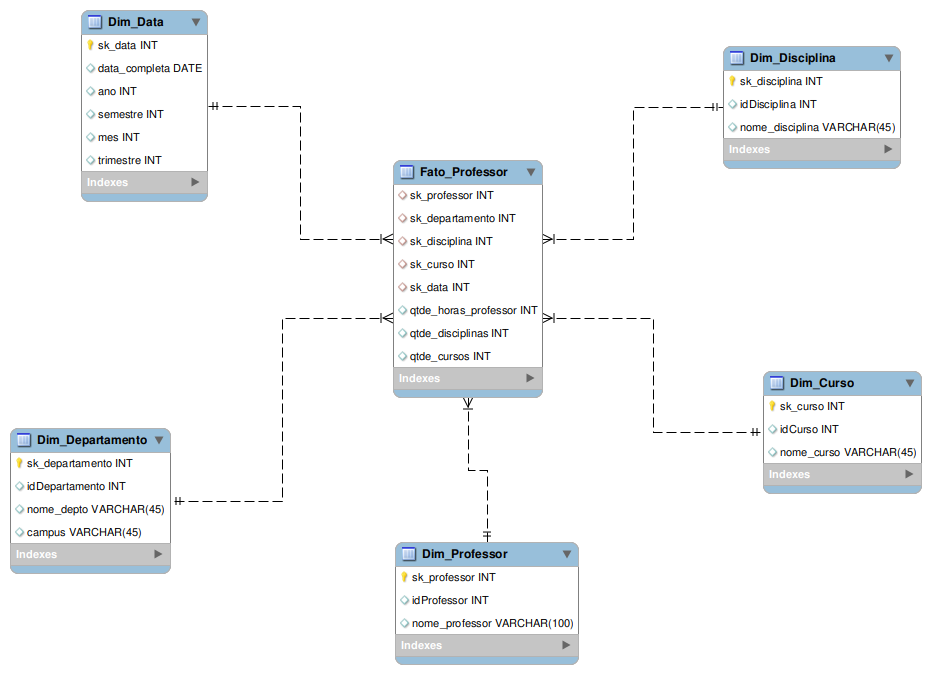

# Desafio de Projeto - Bootcamp Klabin - Módulo 7 - Criar o diagrama dimensional – star schema - Cenário Universidade

## 📌 Descrição do Projeto
Este repositório contém a modelagem de um banco de dados dimensional em estrutura **Star Schema** (Esquema em Estrela). O objetivo principal é a análise de dados voltada ao corpo docente, permitindo extrair métricas de desempenho e carga horária de forma otimizada.

A modelagem foi baseada em um diagrama relacional pré-existente, seguindo as diretrizes de focar no objeto **Professor** e omitir dados relativos a alunos.

---

## 🏗️ Estrutura do Modelo (Star Schema)

O modelo é composto por uma tabela fato central e dimensões que fornecem o contexto descritivo.

### 1. Tabela Fato: `Fato_Professor`
Armazena as métricas quantitativas e as chaves de ligação para as dimensões.
* **Métricas (Fatos):**
    * `qtde_horas_professor`: Total de horas ministradas.
    * `qtde_disciplinas`: Quantidade de disciplinas distintas.
    * `qtde_cursos`: Quantidade de cursos associados.
* **Chaves de Ligação:** Conecta-se às dimensões via **Surrogate Keys (SK)** através de `CONSTRAINTS` de chave estrangeira.

### 2. Tabelas Dimensão
Responsáveis pelos detalhes relacionados ao contexto analisado.
* **`Dim_Professor`**: Atributos do professor.
* **`Dim_Departamento`**: Informações sobre o departamento e campus.
* **`Dim_Disciplina`**: Detalhes das disciplinas oferecidas.
* **`Dim_Curso`**: Dados sobre os cursos da instituição.
* **`Dim_Data`**: Criada para permitir análises temporais (Ano, Semestre, Trimestre, Mês), suprindo a lacuna de dados de data do modelo original.

---

## 🛠️ Tecnologias e Conceitos Aplicados
* **MySQL Workbench**: Utilizado para modelagem e engenharia reversa do esquema.
* **Star Schema**: Arquitetura otimizada para consultas de Business Intelligence.
* **Surrogate Keys (SK)**: Chaves artificiais independentes para garantir a integridade dos dados históricos.
* **Integridade Referencial**: Uso de `CONSTRAINTS` nomeadas para garantir relacionamentos consistentes.

---

## 🚀 Como Executar
1.  Importe o script SQL no **MySQL Workbench**.
2.  Execute o script para criar o banco de dados `universidade_dw`.
3.  Utilize a ferramenta de **Engenharia Reversa** (`Database > Reverse Engineer`) para visualizar o diagrama em estrela.

---

## 👤 Autor
* **Nome:** Adriel Bartolomeu Machado
